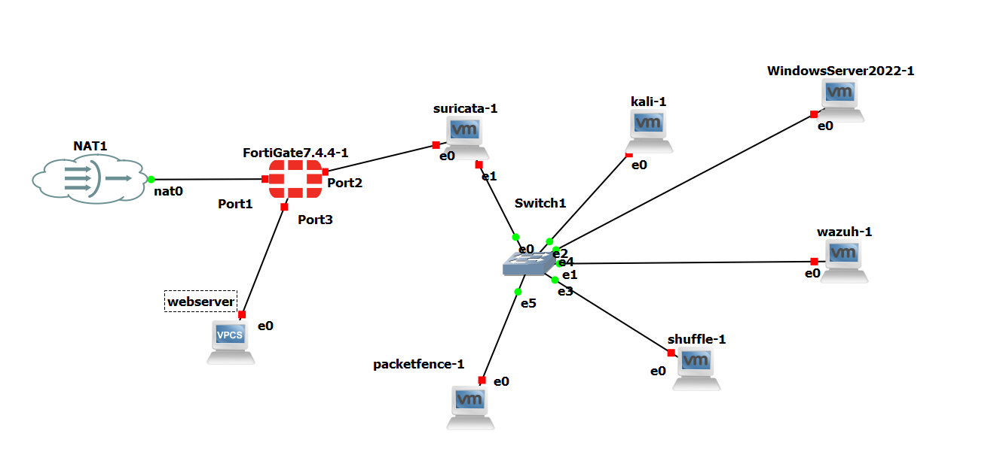

<!-- PROJECT HEADER -->

# 🛡️ Network Infrastructure and Security Project  
### A Multi-Zone Network with an Integrated Security Operations Center (SOC)

📘 **Author:** *Hadir Ben Arbia*  
📅 **Date:** August 2025  

---

## 📖 Overview

This project demonstrates the **design and implementation** of a **multi-zone enterprise network** integrated with a **Security Operations Center (SOC)**.  
It combines advanced network segmentation, intrusion prevention, and **automated incident response** using open-source and commercial technologies.

The environment was built using **GNS3** and **VMware Workstation**, integrating the following technologies:

- 🧱 FortiGate (Next-Generation Firewall)  
- 🧠 Windows Server 2022 (Active Directory & DNS)  
- 🐧 Ubuntu Clients  
- 🕵️ Suricata (Intrusion Prevention System)  
- 🧩 Wazuh (SIEM)  
- ⚙️ Shuffle (SOAR)  
- 🔐 PacketFence (Network Access Control)

---

## 🧩 Architecture Overview

The network is divided into **three primary zones** controlled by FortiGate:

| Zone | Subnet | Purpose |
|------|---------|----------|
| 🟢 **LAN** | `192.168.10.0/24` | Internal trusted network with AD, clients, SOC |
| 🟠 **DMZ** | `192.168.30.0/24` | Hosts public web services |
| 🔵 **WAN** | DHCP | Internet access via GNS3 NAT Cloud |

## 🌐 Network Topology

The project implements a multi-zone architecture segmented into **LAN**, **DMZ**, and **WAN** zones all managed by FortiGate.  
Below is the real topology used for the deployment:

  

---

## ⚙️ Configuration Highlights

### 🔒 **FortiGate Firewall**
- Configured 3 interfaces: WAN, LAN, and DMZ.  
- Implemented DHCP for internal networks.  
- Applied **NAT**, **access policies**, and **traffic logging**.  

### 🧠 **Active Directory Setup**
- Deployed **Windows Server 2022** as Domain Controller.  
- Created forest `project.local`.  
- Integrated Ubuntu clients using `realm join`.

### 🚦 **Suricata IPS**
- Deployed **inline** using bridge interface `br0`.  
- Configured `NFQUEUE` for real-time packet inspection.  
- Detected and blocked ICMP & SSH brute-force attacks.

### 🧰 **Wazuh (SIEM) + Shuffle (SOAR)**
- Wazuh agents collect logs across all zones.  
- Alerts sent via **webhook** to Shuffle.  
- Shuffle triggers **FortiGate API actions** to block attackers automatically.

### 🧩 **PacketFence NAC**
- Controls network access and device compliance.  
- Future-ready for **802.1X** authentication with AD integration.

---

## ⚔️ Attack Simulation — *Hydra Brute-Force*

**Scenario:**  
An attacker (Shuffle VM) launches a brute-force SSH attack against Wazuh.

**Result:**  
✅ Wazuh detects multiple failed logins  
✅ Webhook triggers Shuffle  
✅ Shuffle extracts attacker IP  
✅ FortiGate blocks the IP automatically  

⏱️ **Response Time:** Few seconds  
🧩 *Proves the efficiency of automated detection & response (SIEM + SOAR).*

---

## 🚀 Future Enhancements

- 🧩 **Zero Trust Network Access (ZTNA)** via PacketFence & AD integration  
- ⚙️ **Advanced SOAR Playbooks** (Threat intel enrichment, host isolation)  
- ☁️ **Hybrid Cloud Integration** (AWS / Azure VPN + cloud monitoring)  
- 🧠 **Purple Team Exercises** for continuous security validation  

---

## 🧠 Technologies Stack

  

---

## 📄 Documentation

📘 Full technical report:  
[`rapport_projet.pdf`](./rapport_projet.pdf)

---

## 🏁 Conclusion

This project successfully demonstrates the design of a **realistic, automated, and secure enterprise network** integrating a full SOC ecosystem.  
It showcases practical expertise in **firewall configuration, SIEM, SOAR, NAC, and IPS**, forming a strong foundation for modern **cyber defense infrastructures**.

---

⭐ *If you found this project inspiring, don’t forget to star the repository!*  
💬 *Contributions, issues, and discussions are always welcome.*

